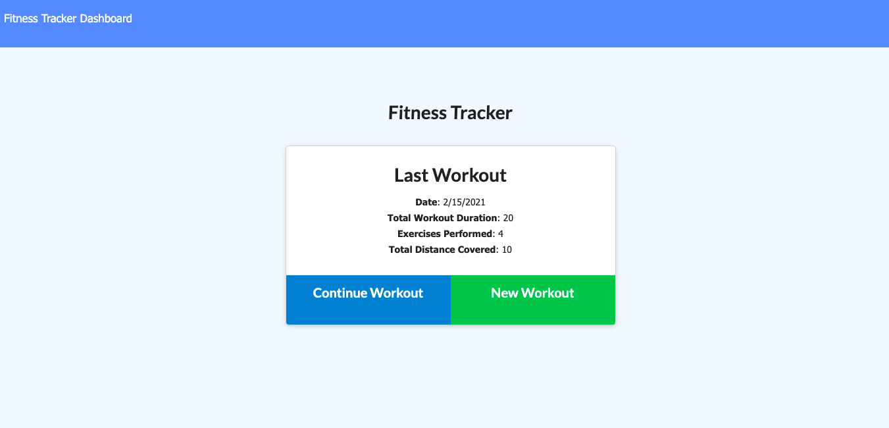
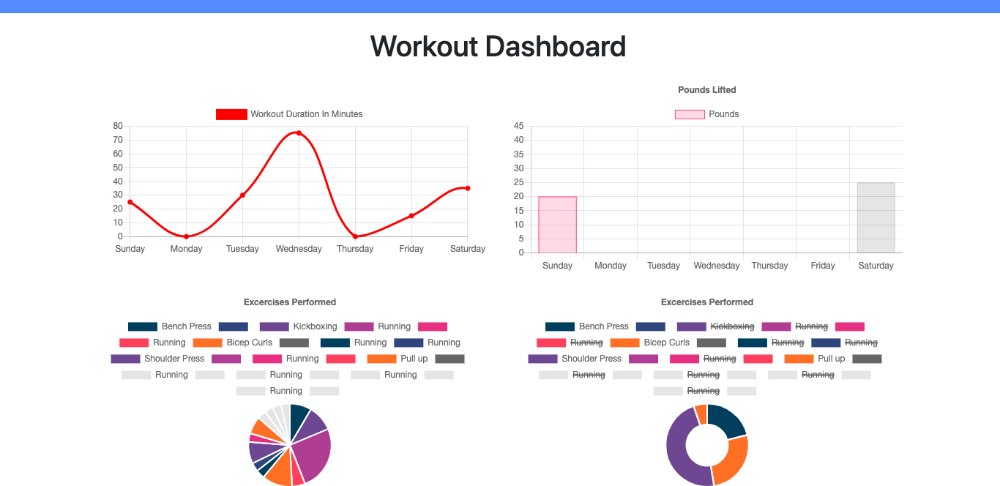

# workout-tracker

## Description 

Application allows users to view, create and track daily workouts. Users are able to log multiple exercises in a workout on a given day. They're able to track the name, type, weight, sets, reps and duration of exercise. If the exercise is a cardio exercise, users should be able to track their distance traveled.

## Installation

* Express
* Mongoose
* Morgan

## Usage

